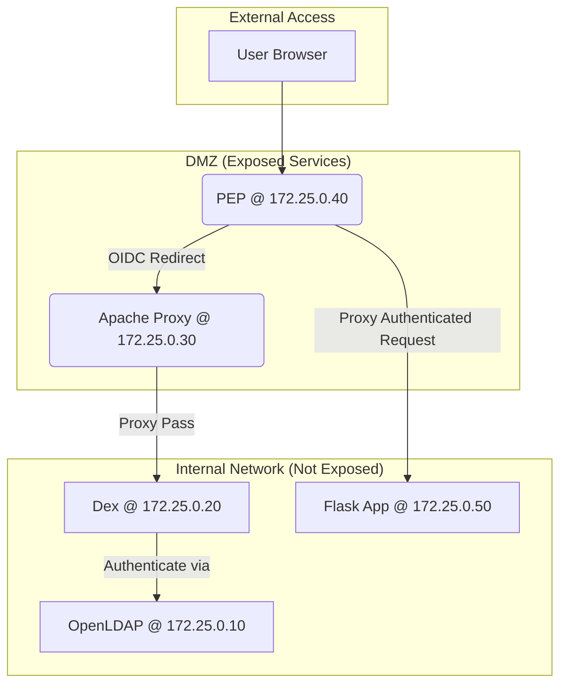

# Project Presentation: OAuth2 PEP for Zero Trust Access

---

### **1. Executive Summary**

This project delivers a **comprehensive OAuth2 Policy Enforcement Point (PEP) architecture** that implements enterprise-grade access control. It is built on **Zero Trust principles** (ANSSI compliant) and integrates with enterprise identity systems via **OpenLDAP**.

The solution provides a centralized authentication gateway that protects backend applications without requiring code modifications, making it ideal for securing both modern and legacy systems.

**Key Deliverables:**
- A fully containerized OAuth2 & OIDC Identity Provider solution.
- Centralized policy enforcement and user authentication.
- Secure integration with backend services via HTTP header injection.

---

### **2. Business Objectives**

- **Enhance Security**: Implement a Zero Trust model where every request is verified.
- **Centralize Authentication**: Simplify access management for multiple applications.
- **Improve Compliance**: Adhere to industry standards like OAuth2, OIDC, and ANSSI security recommendations.
- **Legacy System Integration**: Provide a non-intrusive way to secure existing applications that lack modern authentication capabilities.

---

### **3. Technical Architecture**

The platform is composed of five core services, orchestrated by Docker Compose in an isolated network.

#### **Core Components:**

| Service | Technology | Role |
|---|---|---|
| **PEP (Policy Enforcement Point)**| Apache httpd + `mod_auth_openidc`| The main entry point that intercepts user requests and enforces OIDC authentication. It proxies authenticated requests to backend services. |
| **Apache Reverse Proxy** | Apache httpd + `mod_proxy` | A dedicated routing layer that securely exposes the internal Dex OIDC endpoints (`/auth`, `/token`, etc.) to the PEP. |
| **Dex OIDC Provider** | Dex (CNCF Project) | An OIDC-compliant identity broker that connects to the OpenLDAP backend and issues tokens. |
| **OpenLDAP** | OpenLDAP | The identity source, storing user credentials and group information. |
| **Flask Application** | Python Flask | A sample protected backend service that receives user information via injected HTTP headers. |

#### **High-Level Diagram:**

---

### **4. Authentication Flow**

1.  **Request Initiation**: The user accesses the PEP (`http://172.25.0.40`).
2.  **Authentication Trigger**: The PEP, seeing no valid session, redirects the user to the OIDC provider via the Apache Proxy (`http://172.25.0.30/auth`).
3.  **User Login**: The Dex login page is displayed. The user authenticates with their LDAP credentials.
4.  **Token Issuance**: Dex validates the credentials against OpenLDAP and issues an authorization code back to the PEP.
5.  **Token Exchange**: The PEP exchanges the code for an ID Token and Access Token from Dex.
6.  **Authenticated Access**: The PEP validates the tokens, injects user details into HTTP headers (`X-User-ID`, `X-User-Email`, etc.), and proxies the request to the backend Flask application.
7.  **Service Access**: The Flask application uses the headers to serve a personalized response.

---

### **5. Security Model (Zero Trust)**

Security is enforced at every layer of the architecture.

- **Network Controls**:
  - **Static IP Segmentation**: Each service has a dedicated IP address in a private network (`172.25.0.0/24`), preventing spoofing and enabling strict firewall rules.
  - **Minimal Exposure**: Only the PEP and Apache Proxy have externally mapped ports. All other services are only accessible within the Docker network.

- **Application Controls**:
  - **CSRF Protection**: `state` parameter validation in the OIDC flow and secure, HttpOnly cookies prevent cross-site request forgery.
  - **Strict CORS Policy**: Only allows requests from the trusted PEP to the OIDC proxy, preventing unauthorized browser interactions.
  - **ANSSI-Compliant Headers**:
    - `Strict-Transport-Security`: Enforces HTTPS.
    - `X-Frame-Options: DENY`: Prevents clickjacking.
    - `X-XSS-Protection`: Activates browser-level XSS filtering.
    - `X-Content-Type-Options: nosniff`: Prevents MIME-type sniffing.

- **Identity Controls**:
  - **Centralized Authentication**: All authentication decisions are made by the PEP and Dex, not the backend applications.
  - **Least Privilege**: The backend Flask app only receives the user identity; it has no access to tokens or credentials.

---

### **6. Conclusion**

This project successfully demonstrates a robust, secure, and modern approach to identity and access management. It is a production-ready foundation for any organization looking to implement a Zero Trust architecture while supporting a diverse landscape of applications. 