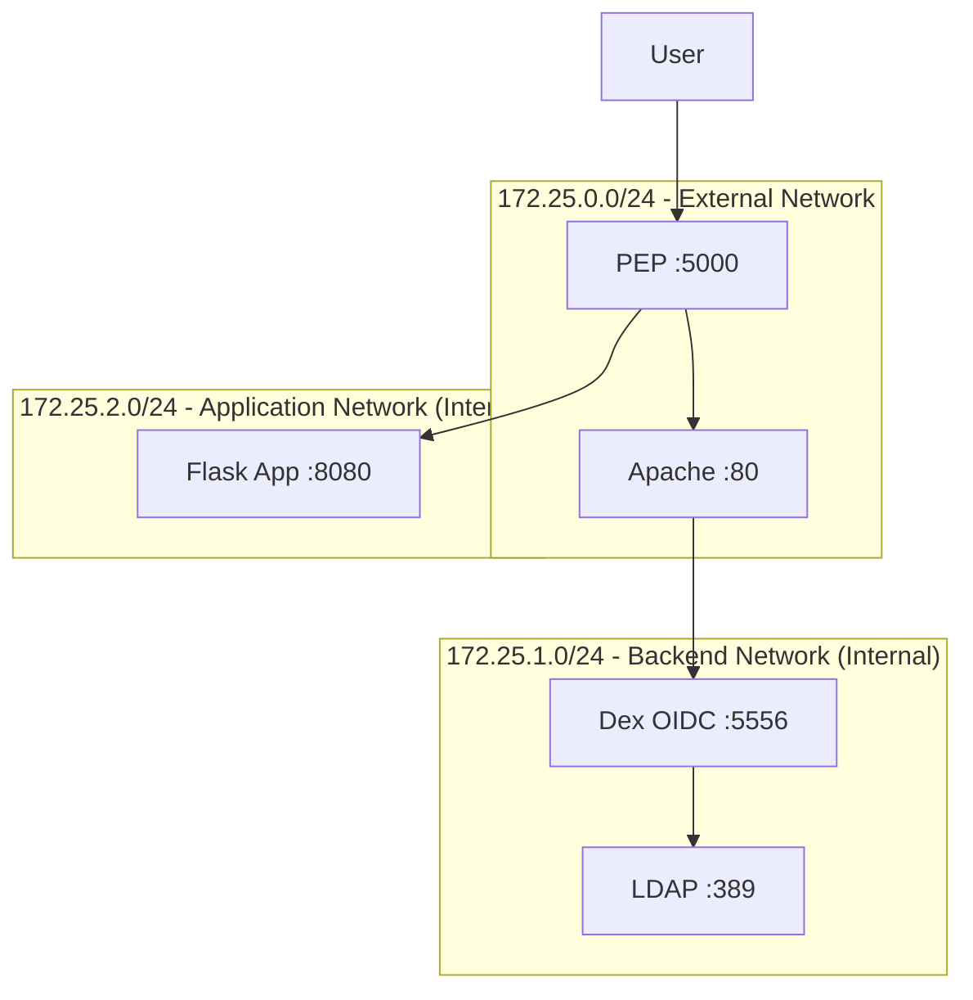
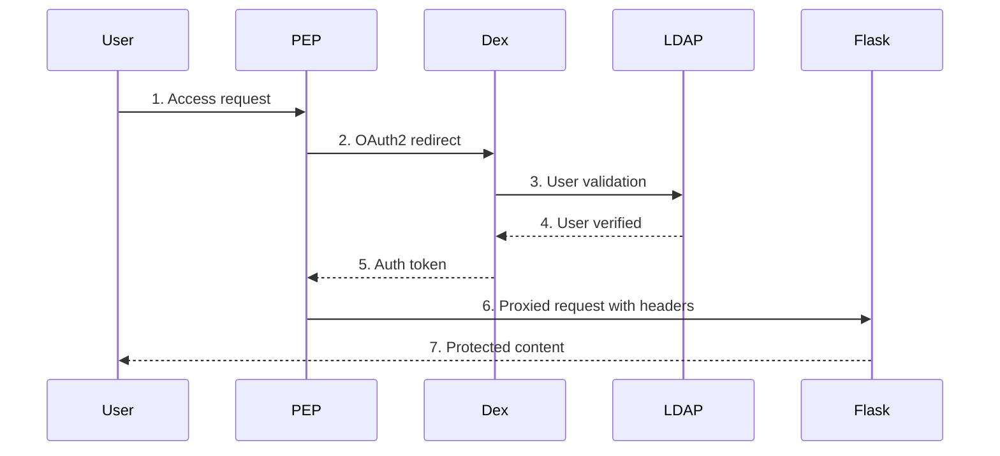

# OAuth2 PEP Multi-Network Architecture

## Overview

This project implements an OAuth2 Policy Enforcement Point (PEP) with 3-tier network segmentation for secure access control using containers.

## Architecture



## Technical Implementation

### Network Segmentation

The architecture implements 3 isolated Docker networks:

```yaml
# External network - Public access
external-network:
  ipam:
    config:
      - subnet: 172.25.0.0/24

# Backend network - Infrastructure isolated
backend-network:
  internal: true  # No internet access
  ipam:
    config:
      - subnet: 172.25.1.0/24

# Application network - Business logic isolated  
app-network:
  internal: true  # No internet access
  ipam:
    config:
      - subnet: 172.25.2.0/24
```

**Justification**: The `internal: true` configuration in docker-compose.yml prevents backend and application services from accessing the internet, implementing network isolation.

### Authentication Flow



### Security Features

| Feature | Implementation | Configuration |
|---------|----------------|---------------|
| **Network Isolation** | Docker internal networks | `internal: true` in docker-compose.yml |
| **CSRF Protection** | SameSite cookies | `OIDCCookieSameSite Lax` in oidc.conf |
| **Session Timeout** | 30min inactivity | `OIDCSessionInactivityTimeout 1800` |
| **Cookie Security** | HTTPOnly flags | `OIDCCookieHTTPOnly On` |
| **Headers Injection** | User info in HTTP headers | `RequestHeader set X-User-*` in oidc.conf |

**Justification**: Each security feature is directly configured in the project files with specific parameter values shown above.

## Service Matrix

| Service | Purpose | Network | Internet Access | Exposed Ports |
|---------|---------|---------|----------------|---------------|
| PEP | Authentication gateway | External | Yes | 5000 |
| Apache | Reverse proxy | External | Yes | 80 |
| Dex | OIDC provider | Backend | No | None |
| LDAP | User directory | Backend | No | None |
| Flask | Business application | Application | No | None |

**Justification**: Only external network services have exposed ports in docker-compose.yml. Backend services use `expose:` instead of `ports:`, preventing external access.

## Implementation Details

### OIDC Configuration
- **Provider**: Dex at `http://172.25.1.20:5556`
- **Client**: `flask-app` with secret `flask-app-secret`
- **Scopes**: `openid email profile groups`
- **Token endpoint**: Internal network communication

### LDAP Integration
- **Backend**: OpenLDAP with test users (user1-user4)
- **Bind DN**: `cn=admin,dc=example,dc=org`
- **User search**: `ou=people,dc=example,dc=org`
- **Groups**: `ou=groups,dc=example,dc=org`

### Application Security
The Flask application validates authentication via HTTP headers:
```python
def get_user_from_headers():
    return {
        'id': request.headers.get('X-User-ID'),
        'authenticated': request.headers.get('X-Authenticated') == 'true'
    }
```

If `X-Authenticated` header is not present, access is denied with 403 error.

## Network Security Validation

The backend network isolation can be verified:
```bash
# Check network configuration
docker network inspect idp-backend | grep '"Internal": true'

# Verify LDAP not accessible externally
curl http://localhost:389  # Connection refused

# Verify Dex not accessible externally  
curl http://localhost:5556  # Connection refused
```

**Justification**: Commands above demonstrate that backend services are not accessible from the host, proving network isolation works.

## Key Benefits

1. **Attack Surface Reduction**: Only 2 ports exposed (80, 5000) vs traditional setup
2. **Identity Store Protection**: LDAP completely isolated from internet access
3. **Application Isolation**: Business logic cannot be directly accessed
4. **Centralized Authentication**: Single point of access control for multiple applications

## Limitations

- **HTTP only**: No TLS encryption (development setup)
- **Memory storage**: Dex uses in-memory storage (not persistent)
- **Single instance**: No high availability configuration
- **Basic LDAP**: Simple user structure without advanced features 