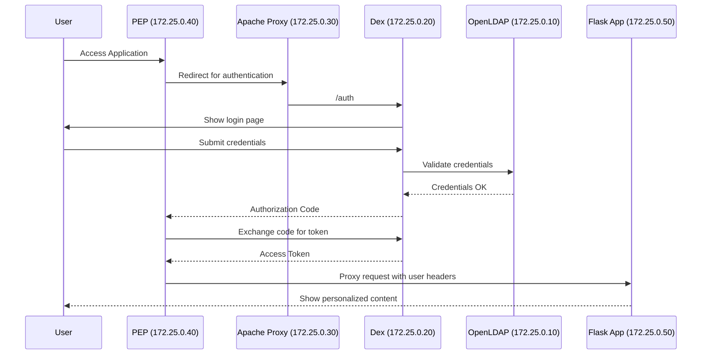

# OAuth2 PEP for Zero Trust Access
## Enterprise-Grade Identity Provider (IDP) with LDAP & OIDC

This project delivers a comprehensive **OAuth2 Policy Enforcement Point (PEP)** architecture, implementing enterprise-grade access control based on **Zero Trust principles** (ANSSI compliant). It provides a complete authentication gateway that protects backend applications while maintaining strict separation of concerns between identity management, access enforcement, and business logic.

---

## 🚀 Key Features

- ✅ **Zero Trust Architecture**: Every request is validated through a centralized PEP.
- ✅ **Standards Compliant**: Full OAuth2 (RFC 6749) and OpenID Connect (OIDC) Core 1.0 implementation.
- ✅ **Identity Federation**: LDAP integration via Dex, with an extensible connector architecture.
- ✅ **Enterprise Security**: Static IP segmentation, strict CORS, CSRF protection, and security headers (ANSSI).
- ✅ **Transparent Integration**: Protects backend applications without requiring code changes, using HTTP header injection.

---

## 🏗️ Technical Architecture

This project implements a secure, multi-component architecture orchestrated by Docker Compose:

| Service | IP Address | Port (External) | Description |
|---|---|---|---|
| **PEP (Policy Enforcement Point)** | `172.25.0.40` | `5000` | Main entry point. Enforces OIDC authentication. |
| **Apache Reverse Proxy** | `172.25.0.30` | `80` | Routes OIDC endpoints to the Dex server. |
| **Dex OIDC Provider** | `172.25.0.20` | *(internal)* | OIDC server that connects to the LDAP backend. |
| **OpenLDAP Backend** | `172.25.0.10` | `1389` / `1636` | Identity store with test users. |
| **Flask Application** | `172.25.0.50` | *(internal)* | Protected backend service (example). |

### Authentication Flow


---

## 🏁 Quick Start

For detailed instructions on setup, usage, and troubleshooting, please refer to the `ACCESS_GUIDE.md` file.

1. **Build and start all services:**
   ```bash
   docker compose up --build -d
   ```

2. **Access the application:**
   - Open your browser and navigate to `http://172.25.0.40`.
   - **Do not use `localhost:5000`**; it is intentionally blocked for security.

3. **Login:**
   - Click "Login with LDAP".
   - Use one of the test accounts (e.g., `user1` / `password1`).

---

## 🛠️ Configuration

- **`docker-compose.yml`**: Defines all services, networks, and static IPs.
- **`dex/config.yaml`**: Configures the Dex OIDC provider, including the LDAP connector and client details.
- **`apache-proxy/apache.conf`**: Apache configuration for the reverse proxy, including security headers and routing rules.
- **`PEP/oidc.conf`**: OIDC module configuration for the Policy Enforcement Point.
- **`LDAP/bootstrap.ldif`**: Defines the initial LDAP users and groups.

---

## 🛡️ Security Implementation

This project enforces a strict Zero Trust security model:

- **Network Segmentation**: All services are isolated in a dedicated Docker network with static IPs. Only essential ports are exposed.
- **CSRF Protection**: State parameters and secure cookies are used throughout the OAuth2 flow to prevent cross-site request forgery.
- **Strict CORS Policy**: Cross-Origin Resource Sharing is restricted to only allow communication between trusted components.
- **ANSSI-Compliant Headers**: Includes `X-Frame-Options`, `X-XSS-Protection`, `Strict-Transport-Security`, and others.
- **IP Whitelisting**: Access to sensitive endpoints is restricted to the internal Docker network.

---

## 📄 Documentation

- **`README.md`**: (This file) High-level overview of the project.
- **`PRESENTATION.md`**: A detailed slide-deck style presentation covering the technical architecture, security model, and business objectives.
- **`ACCESS_GUIDE.md`**: Step-by-step guide for running the project, logging in, and troubleshooting common issues.

---
*This project provides a robust foundation for building secure, enterprise-ready identity and access management systems.* 