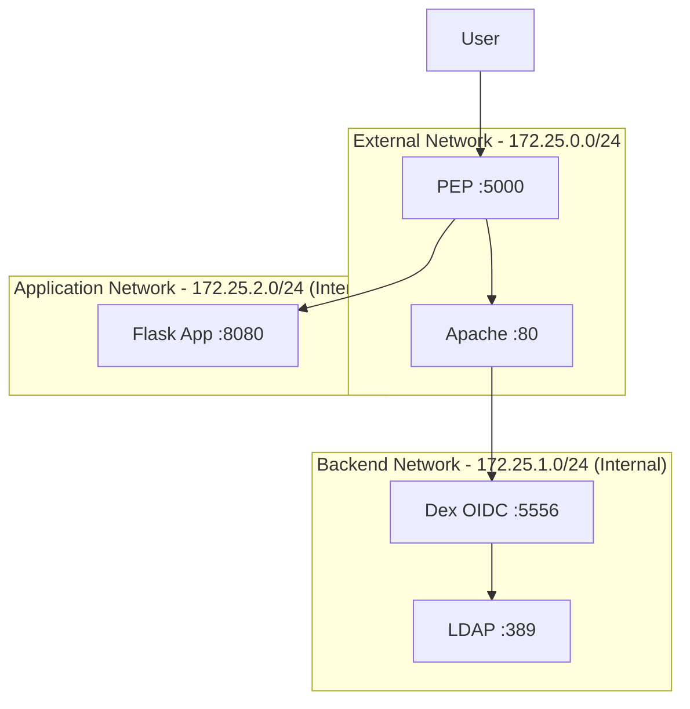

# OAuth2 PEP with Multi-Network Architecture

A containerized OAuth2 Policy Enforcement Point (PEP) implementing 3-tier network segmentation for secure access control.

## Architecture



## Features

- **Network Segmentation**: 3-tier isolation (external, backend, application)
- **OAuth2/OIDC**: Integration with Dex identity provider and LDAP backend
- **Zero External Access**: Backend and application networks isolated from internet
- **Security Headers**: CSRF protection, session management, cookie security

## Quick Start

```bash
# Start all services
docker compose up -d

# Access the application
curl http://172.25.0.40:5000
```

**Test Accounts:**
- Username: `user1`, Password: `password1`
- Username: `user2`, Password: `password2`

## Services

| Service | Network | Ports | Description |
|---------|---------|-------|-------------|
| PEP | External | 5000 | OAuth2 Policy Enforcement Point |
| Apache | External | 80 | Reverse proxy for Dex |
| Dex | Backend | 5556 | OIDC identity provider |
| LDAP | Backend | 389 | User directory |
| Flask | Application | 8080 | Protected application |

## Configuration

### Network Security
- **Backend network**: `internal: true` - no internet access
- **Application network**: `internal: true` - no internet access  
- **LDAP**: Ports not exposed to host (accessible only within backend network)

### OIDC Configuration
- **Provider**: Dex at `http://172.25.1.20:5556`
- **Client ID**: `flask-app`
- **Scopes**: `openid email profile groups`
- **Session timeout**: 30 minutes inactivity

## Development

```bash
# View logs
docker compose logs -f <service>

# Check service status
docker compose ps

# Access LDAP for debugging
docker exec ldap-server ldapsearch -x -b "dc=example,dc=org"
```

## Security Implementation

- **Network Isolation**: Backend services cannot access internet
- **CSRF Protection**: SameSite cookies and origin validation
- **Session Security**: 30min timeout, secure cookie flags
- **Headers Injection**: User info passed via HTTP headers to applications
- **JWT Encryption**: AES-256-GCM for token encryption

## Architecture Justification

This implementation follows network segmentation principles:

1. **External tier**: Public-facing services only (PEP, Apache proxy)
2. **Backend tier**: Infrastructure services isolated from internet (LDAP, Dex)
3. **Application tier**: Business logic completely isolated (Flask)

The backend network configuration `internal: true` in docker-compose.yml ensures no external internet access to identity services, reducing attack surface. 