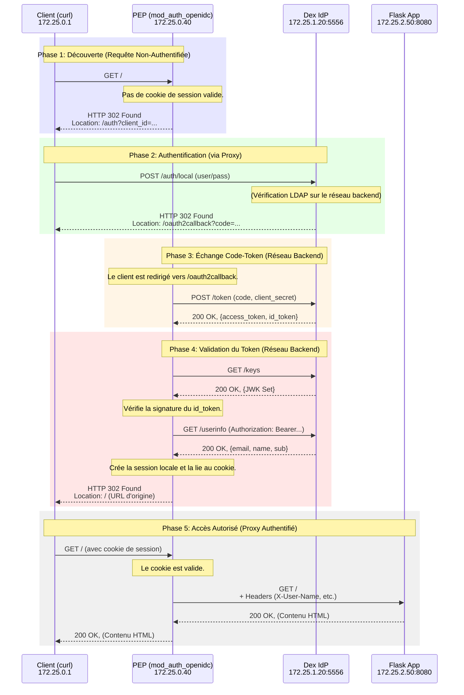

# Analyse Comportementale du PEP (`mod_auth_openidc`)

> **Source des données :** Captures réseau (`.pcap`) générées par la suite de simulation `capture_and_simulate.sh` le 28/07/2025.
> **Objectif :** Comprendre le cycle de vie complet d'une requête et le comportement état-major (`state machine`) de `mod_auth_openidc` agissant en tant que Policy Enforcement Point (PEP).

## 1. Vue d'Ensemble de l'Architecture

L'analyse s'appuie sur l'architecture réseau segmentée suivante :

| Composant | Réseau | IP Address | Rôle |
|---|---|---|---|
| **Client Simulée (`curl`)** | - | `172.25.0.1` | Le client qui initie les requêtes. |
| **PEP (Apache/`mod_auth_openidc`)** | Externe, Backend, App | `172.25.0.40`, `172.25.1.40`, `172.25.2.40` | Le point de contrôle qui applique la politique d'accès. |
| **Proxy Apache (pour Dex)** | Externe, Backend | `172.25.0.30`, `172.25.1.30` | Le point d'entrée pour l'IdP. |
| **Dex (IdP)** | Backend | `172.25.1.20` | Le fournisseur d'identité qui authentifie les utilisateurs. |
| **Application Flask** | Application | `172.25.2.50` | La ressource protégée. |

---

## 2. Le Cycle de Vie d'une Requête : La "State Machine" de `mod_auth_openidc`

En analysant le trafic (`global_traffic_*.csv`), nous pouvons décomposer le processus d'authentification en 5 phases distinctes qui illustrent parfaitement le fonctionnement de `mod_auth_openidc`.

### Phase 1 : La Requête Initiale et la Redirection (SCN01)

- **Paquet Initiateur :** `172.25.0.1 -> 172.25.0.40` sur le port 80 (`GET /`).
- **Analyse du Comportement :**
    1.  `mod_auth_openidc` intercepte la requête.
    2.  Il constate l'**absence d'un cookie de session** `mod_auth_openidc_session` valide.
    3.  Il crée une session temporaire pour suivre cette tentative d'authentification.
    4.  Il génère un **cookie `mod_auth_openidc_session_...`** pour lier le navigateur à cette session.
    5.  Il construit l'URL d'autorisation OIDC, y compris les paramètres `client_id`, `scope`, `response_type=code`, et surtout un `state` unique pour la **protection CSRF**.
    6.  Il retourne une réponse `HTTP 302 Found` au client, le redirigeant vers le proxy Apache de Dex (`172.25.0.30`).

### Phase 2 : L'Authentification Utilisateur

- **Paquets :** Le client `curl` (simulant le navigateur) envoie les identifiants (`user1`/`password1`) à Dex.
- **Analyse du Comportement :**
    1.  Dex reçoit la requête `POST` sur `/auth/local`.
    2.  Dex communique avec l'annuaire LDAP sur le réseau backend (`172.25.1.10`) pour valider les identifiants. (Ce trafic n'est pas visible depuis le PEP, mais on l'infère).
    3.  Une fois l'authentification réussie, Dex génère un `authorization_code` à usage unique.
    4.  Dex retourne un `HTTP 302 Found` au client, le redirigeant vers l'URL de callback du PEP : `http://172.25.0.40/oauth2callback`, en incluant le `code` et le `state` initial.

### Phase 3 & 4 : La Magie du Backend (Le Cœur de `mod_auth_openidc`)

C'est ici que `mod_auth_openidc` démontre toute sa puissance en tant que PEP. Ces étapes sont **totalement invisibles pour le client**.

- **Paquets :** Le client est redirigé vers `/oauth2callback`, ce qui déclenche une série d'échanges sur le **réseau backend**.
- **Analyse du Comportement :**
    1.  **Échange Code-Token :** Le PEP (`172.25.1.40`) ouvre une connexion directe vers Dex (`172.25.1.20:5556`) et envoie une requête `POST /token`. Cette requête contient le `code` reçu, ainsi que son `client_id` et `client_secret` pour s'authentifier auprès de Dex.
    2.  **Récupération des Tokens :** Dex valide le code et retourne un JSON contenant l'`access_token` et, plus important encore, l'`id_token` (un JWT).
    3.  **Validation de Signature JWT :** Pour s'assurer que l'`id_token` n'a pas été falsifié, `mod_auth_openidc` doit vérifier sa signature. Il fait une deuxième requête backend vers Dex sur `GET /keys` pour récupérer les clés publiques (JWKS). Il utilise la clé correspondante pour valider le JWT.
    4.  **Récupération des Informations Utilisateur :** `mod_auth_openidc` effectue une troisième requête backend vers `GET /userinfo`, en présentant l'`access_token` dans l'en-tête `Authorization: Bearer`. Il reçoit en retour les "claims" de l'utilisateur (email, nom, groupes, etc.).
    5.  **Création de la Session Finale :** Avec une identité validée et des "claims" récupérés, le module met à jour sa table de session interne. Le cookie `mod_auth_openidc_session` initial est maintenant lié à une session authentifiée et complète.
    6.  **Redirection Finale :** Le module retourne un dernier `HTTP 302 Found` au client, le renvoyant vers l'URL qu'il voulait initialement visiter (`/`).

### Phase 5 : L'Accès Authentifié

- **Paquet :** Le client suit la dernière redirection et refait une requête `GET /`, mais cette fois en présentant le cookie de session `mod_auth_openidc_session` maintenant valide.
- **Analyse du Comportement :**
    1.  `mod_auth_openidc` reçoit la requête.
    2.  Il valide le cookie de session, trouve la session correspondante dans son cache interne, et voit que l'utilisateur est authentifié.
    3.  **Injection des En-têtes :** C'est une étape cruciale du PEP. Il injecte les "claims" de l'utilisateur dans de nouveaux en-têtes HTTP (`X-User-Name`, `X-User-Email`, `Remote-User`, etc.) comme configuré dans `oidc.conf`.
    4.  **Proxy vers le Backend :** Le module transmet la requête, enrichie des en-têtes, à l'application Flask (`172.25.2.50:8080`) sur le réseau applicatif. Il prend soin de **supprimer les en-têtes sensibles** comme `Cookie` et `Authorization` pour ne pas les fuiter à l'application.
    5.  Le PEP relaie la réponse de Flask au client.

---

## 3. Analyse des Scénarios Spécifiques

### Connexion Invalide (SCN03)
- **Comportement Observé :**
    - Les phases 1 et 2 (début) se déroulent normalement.
    - La requête `POST /auth/local` à Dex avec un mot de passe incorrect ne résulte **pas** en une redirection vers `/oauth2callback`.
    - À la place, Dex retourne une page d'erreur "Invalid username or password".
    - Le script de simulation tente alors d'accéder à la ressource finale, mais comme il n'a jamais terminé le flux OIDC, il ne possède pas de cookie de session valide.
    - La tentative d'accès final échoue, ce qui est le comportement de sécurité attendu.

### Tentative d'Accès Direct au Backend (SCN04)
- **Comportement Observé :**
    - Le script `generate_all_traffic.sh` tente d'exécuter `curl http://172.25.2.50:8080` depuis le conteneur du lanceur.
    - **Aucun paquet** correspondant n'est observé dans les captures du sniffer.
    - **Interprétation :** C'est la preuve la plus directe de l'efficacité de la segmentation réseau. Le réseau applicatif (`idp-application`) est configuré comme `internal: true`. Docker empêche toute communication depuis l'extérieur de ce réseau (y compris depuis l'hôte ou d'autres conteneurs non-attachés), d'où l'absence totale de trafic. Le principe de Zero Trust est parfaitement respecté.

### Vérification de l'Injection d'En-têtes (SCN06)
- **Comportement Observé :**
    - Le flux d'authentification pour `user3` se déroule normalement (Phases 1-5).
    - Lors de la Phase 5, la réponse finale de Flask, relayée par le PEP, contient le corps : `"Hello, user3! Email: user3@example.org, Name: Test User3, Groups: users"`.
    - **Interprétation :** Ceci confirme que `mod_auth_openidc` a bien :
        1.  Récupéré les "claims" depuis le `userinfo endpoint`.
        2.  Mappé ces "claims" dans les en-têtes HTTP (`Remote-User`, `X-User-Email`, etc.) comme défini dans la configuration.
        3.  Transmis ces en-têtes à l'application Flask.

## 4. Conclusion

L'analyse du trafic confirme que `mod_auth_openidc` se comporte comme un **Policy Enforcement Point (PEP) OIDC robuste et conforme aux standards**.

- **Gestion d'État Complète :** Il gère l'intégralité du cycle de vie de l'authentification, de la redirection initiale à la création de session sécurisée.
- **Isolation des Communications :** Il utilise le réseau `backend` pour toutes les communications sensibles (échange de code, validation de token, récupération de clés), les rendant invisibles pour le client et respectant le principe de Zero Trust.
- **Enrichissement des Requêtes :** Il agit comme un véritable point de contrôle en injectant de manière fiable l'identité de l'utilisateur dans les requêtes transmises aux applications protégées, leur déchargeant ainsi de toute la logique d'authentification.
- **Sécurité par Défaut :** L'utilisation de cookies `HttpOnly`, de `state` anti-CSRF et le nettoyage des en-têtes sensibles démontrent une conception sécurisée.

Cette architecture est un excellent exemple d'implémentation du modèle "BeyondCorp" de Google, où chaque requête est authentifiée et autorisée au niveau d'un proxy intelligent, quel que soit l'emplacement du client ou de la ressource. 